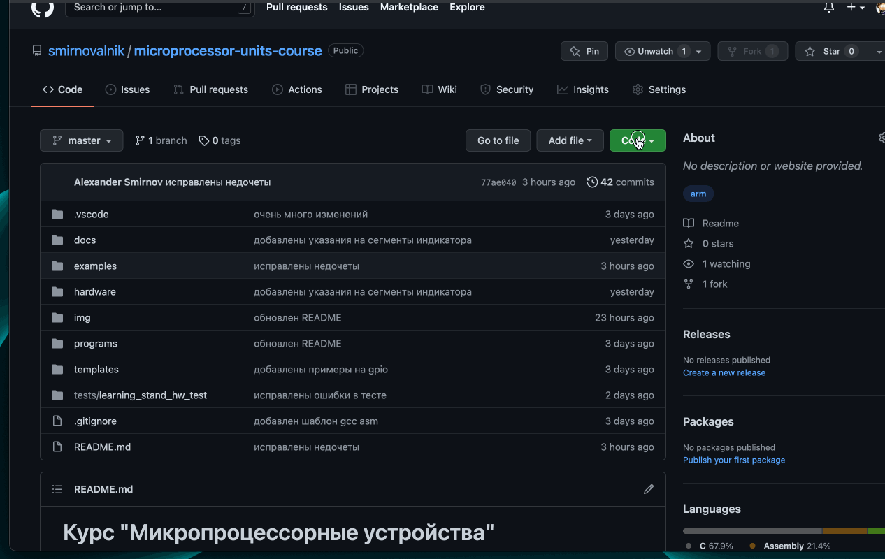
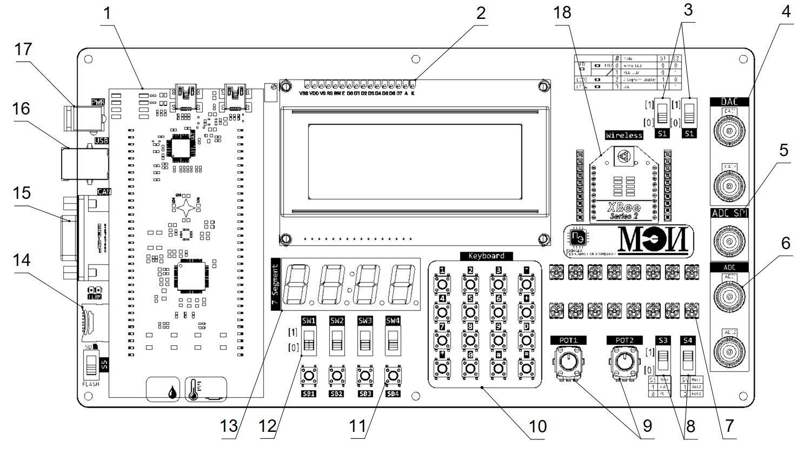
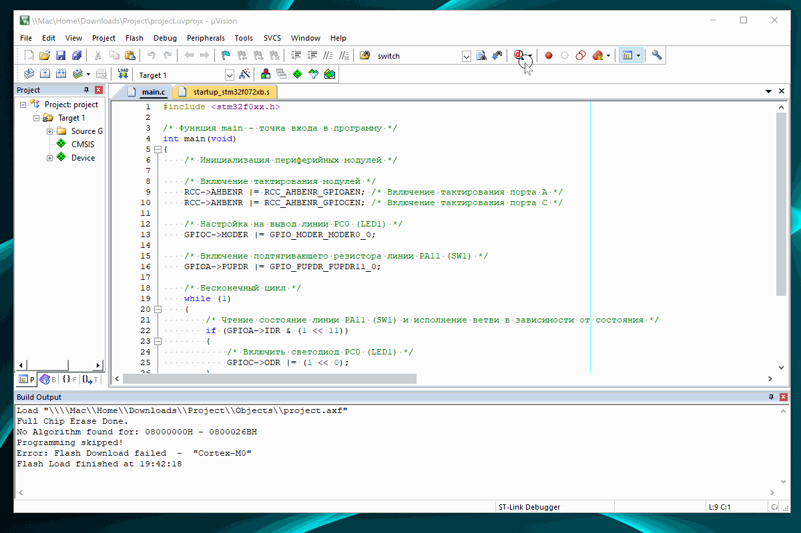
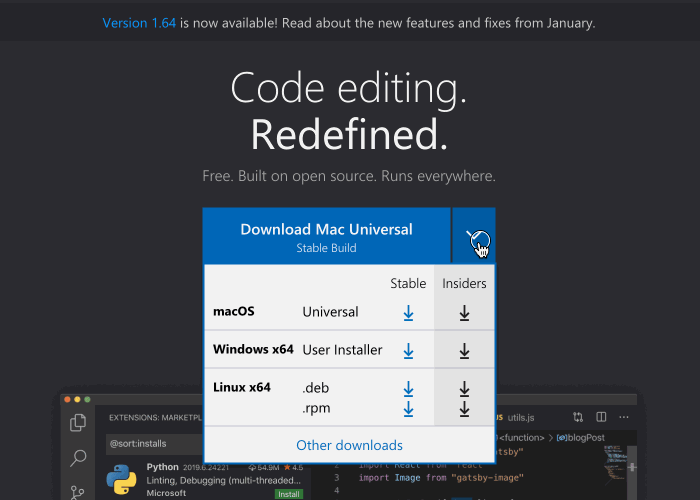

# Курс "Микропроцессорные устройства"

Кафедра [Промышленная электроника](https://mpei.ru/Structure/Universe/ire/structure/ie/Pages/default.aspx) [НИУ МЭИ](https://mpei.ru/).

 

## Оглавление

- [Курс "Микропроцессорные устройства"](#курс-микропроцессорные-устройства)
  - [Оглавление](#оглавление)
  - [Цели](#цели)
  - [Структура курса](#структура-курса)
    - [Часть 1](#часть-1)
    - [Часть 2](#часть-2)
  - [Репозиторий](#репозиторий)
    - [Клонирование проекта](#клонирование-проекта)
    - [Загрузка репозитория в виде zip архива](#загрузка-репозитория-в-виде-zip-архива)
  - [Перечень директорий репозитория](#перечень-директорий-репозитория)
  - [Методические пособия](#методические-пособия)
  - [Полезные ссылки](#полезные-ссылки)
  - [Учебный стенд](#учебный-стенд)
  - [Установка и настройка инструментов разработки](#установка-и-настройка-инструментов-разработки)
    - [Keil uVision5](#keil-uvision5)
      - [Создание нового проекта в Keil uVision5](#создание-нового-проекта-в-keil-uvision5)
      - [Настройка подключения ST-Link в Keil uVision5](#настройка-подключения-st-link-в-keil-uvision5)
      - [Исправление ошибки загрузки программы в Keil uVision5](#исправление-ошибки-загрузки-программы-в-keil-uvision5)
    - [vscode gcc](#vscode-gcc)
      - [Windows](#windows)
      - [Linux](#linux)
      - [MacOS](#macos)
      - [Текстовый редактор vscode](#текстовый-редактор-vscode)

## Цели

Целями первой части курса являются:

- изучение принципов построения микропроцессорных устройств
- изучение языка программирования Ассемблер и его применения для встраиваемых
  микропроцессорных систем

Целями второй части курса являются:

- изучение языка программирования C и его применения для встраиваемых
  микропроцессорных систем
- изучение периферийных модулей микроконтроллера _STM32F072RBT6_

## Структура курса

### Часть 1

- лекции
- практические занятия
- лабораторные работы
- зачет с оценкой

### Часть 2

- лекции
- практические занятия
- лабораторные работы
- экзамен

## Репозиторий

Материалы курса размещены на [GitHub](https://github.com),
который является большим хранилищем программ (исходных текстов)
под управлением системы контроля версий `git`.

Репозиторий непрерывно обновляется и поэтому рекомендуется подтягивать изменения.

Приветствуется поиск ошибок и неточностей в этом репозитории.
Если вы нашли неточность, то можете создать `pull request` на добавление ваших изменений.

Если вы не знакомы с `git`, то можете периодически скачивать архив проекта по указанной ниже инструкции.

### Клонирование проекта

```bash
git clone https://github.com/smirnovalnik/microprocessor-units-course.git
```

### Загрузка репозитория в виде zip архива



## Перечень директорий репозитория

- [docs](./docs/) - документация на микроконтроллер и учебный стенд
  - [asm_c_lang](./docs/asm_c_lang/) - шпаргалка по ассемблеру ARM и языку C
  - [learning_stand](./docs/learning_stand/) - документация (спецификации, схемы электрические принципиальные, сборочные чертежи) на _Учебный стенд_
  - [mcu_st_official](./docs/mcu_st_official/) - официальная документация (технические описания, руководства и т.д.) на МК _STM32F072RBT6_
  - [peripheral](./docs/peripheral/) - описание регистров специальных функций МК _STM32F072RBT6_
  - [misc](./docs/misc/) - различные полезные документы
- [exam](./exam/) - вопросы к зачету и экзамену, примеры билетов
- [examples](./examples/) - примеры лабораторных работ и задачи для практических занятий
  - [part1](./examples/part1/) - для первой части курса
    - `TODO`
  - [part2](./examples/part2/) - для второй части курса
    - [labs](./examples/part2/labs/) - примеры лабораторных работы
      - [lab1](./examples/part2/labs/lab1/) - пример задачи _Лабораторной работы №1 Порты ввода/вывода и АЦП_
      - [lab1](./examples/part2/labs/lab2/) - пример задачи _Лабораторной работы №2 Бегущий огонь_
      - [lab1](./examples/part2/labs/lab3/) - пример задачи _Лабораторной работы №3 Интерфейс SPI_
    - [workshop](./examples/part2/workshop/) - примеры, разобранные на практических занятиях
      - [ex1](./examples/part2/workshop/ex1) - примеры решения четырех практических задач: _Включение светодиода_, _Включение светодиода по абсолютным адресам_,
            _Управление светодиода переключателем_, _Мигающий светодиод_
      - [ex2](./examples/part2/workshop/ex2) - примеры решения двух практических задач: _Чтение АЦП программным опросом_, _Антидребезг кнопки_
      - [ex3](./examples/part2/workshop/ex3) - примеры решения двух практических задач: _Внешние прерывания на портах ввода/вывода_, _Прерывание по окончанию преобразования АЦП_
      - [ex4](./examples/part2/workshop/ex4) - пример решения практической задачи: _Бегущий огонь_
      - [ex5](./examples/part2/workshop/ex5) - пример решения практической задачи: _Регулирование яркости светодиодов с помощью таймера_
      - [ex6](./examples/part2/workshop/ex6) - пример решения практической задачи: _Подключение внешней Flash памяти по SPI_
      - [ex7](./examples/part2/workshop/ex7) - пример решения практической задачи: _Часы_
- [hardware](./hardware/) - исходные файлы проекта _Учебный стенд_ в Altium Designer
- [img](./img/) - различные картинки используемые в README файлах
- [lectures](./lectures/) - слайды и тексты программ использованные на лекциях
- [programs](./lectures/) - программы для установки
- [tests](./tests/) - проекты для теста аппаратного обеспечения _Учебного стенда_
- [templates](./templates/) - шаблоны проектов

## Методические пособия

Для обучения программированию на языке C
обязательна к прочтению и **решению всех упражнений** книга
_Б. Керниган, Д. Ритчи "Язык программирования C"_

## Полезные ссылки

- [Страница по stm32072rb от производителя](https://www.st.com/en/microcontrollers-microprocessors/stm32f072rb.html)
- [Страница по stm32f072-disco от производителя](https://www.st.com/en/evaluation-tools/32f072bdiscovery.html)

## Учебный стенд

Конструктивно стенд состоит из нескольких плат с электронными компонентами: отладочная плата _STM32F072B-DISCO_, основная плата, ЖК индикатор, модуль беспроводной передачи данных.

Основная плата содержит исполнительные устройства и устройства ввода для микропроцессорного контроллера. Эта плата разработана на кафедре Промышленной Электроники НИУ МЭИ.

Отладочная плата _STM32F072B-DISCO_ содержит изучаемый МК _STM32F072RBT6_, а также программатор _ST-LINK/V2_. Программатор позволяет загружать коды программы для микроконтроллера, которые подготовлены в ПК, в постоянную память МК и затем наблюдать на экране монитора ПК за исполнением этой программы микроконтроллером.

Плата _STM32F072RBT6_ содержит небольшое количество устройств ввода и вывода информации. Плата с внешними элементами расширяет возможности по вводу и выводу, что позволяет создать множество различных учебных заданий, используя индикацию и всевозможные кнопки и переключателями.



1. Отладочная плата _STM32F072B-DISCO_
2. Цифро-буквенный ЖКИ индикатор со встроенным контроллером
3. Переключатели для смены периферийных устройств
4. Выходы ЦАП с разъемом BNC
5. Вход АЦП по SPI с разъемом BNC
6. Вход АЦП с разъемом BNC
7. 16 RGB светодиодов (LED1-LED16)
8. Переключатели для выбора канала АЦП между входами BNC и потенциометрами POT1, POT2
9. Потенциометры (POT1 и POT2)
10. Клавиатура, состоящая из 16 тактовых кнопок без фиксации
11. Тактовые кнопки без фиксации (SB1-SB4)
12. Переключатели (SW1-SW4)
13. 4-х разрядный семисегментный индикатор
14. Разъем для SD карты
15. Разъем CAN
16. Разъем USB-UART
17. Разъем питания
18. Модуль передачи данных (ZigBee, Wi-Fi, Bluetooth)

## Установка и настройка инструментов разработки

### Keil uVision5

Разработка программ для микроконтроллера проводится
в интегрированной среде разработки (Integrated Development Environment - IDE)
[Keil MDK Lite Edition](http://www2.keil.com/mdk5/editions/lite).
Для загрузки потребуется регистрация на сайте Keil.
Установка ничем не отличается от установки любой другой программы для Windows.

> :bulb: **Примечание:** Избегайте русскоязычных названий директорий как в пути установки программы, так и в путях к вашим проектах. Некоторые компоненты среды разработки могут не работать.

Эта версия обладает практически полной функциональностью профессиональной версии,
но с ограничением на размер скомпилированной программы в 32 кБайта.
Для лабораторных работ и практических занятий данного курса этого более чем достаточно.

В `Keil MDK Lite Edition` есть симулятор, поэтому работу программы
можно проверить без отладочной платы. Однако данный симулятор поддерживает
только центральный процессор, но не периферийные модули микроконтроллера.

Keil MDK Lite Edition изначально ничего не знает о микроконтроллерах
фирмы ST. Поэтому потребуется скачать и установить пакет с библиотеками для `stm32f0` по ссылке
[Keil.STM32F0xx_DFP.2.1.0.pack](./programs/Keil.STM32F0xx_DFP.2.1.0.pack).

#### Создание нового проекта в Keil uVision5


#### Настройка подключения ST-Link в Keil uVision5


#### Исправление ошибки загрузки программы в Keil uVision5



### vscode gcc

Установка всех компонентов будет происходить в командной строке.
Последовательность действий зависит от операционной системы.

> :bulb: **Примечание:** Использование инструментов `gcc` и `vscode` не обязательно. Все примеры практических задач и лабораторных работ сопровождаются проектом в `Keil uVision5`.

#### Windows

Открыть командную строку в режиме администратора.

- Скачать и установить пакетный менеджер __Chocolatey__

    Пакетный менеджер позволит быстро устанавливать необходимые программы не прибегая к поиску установочных файлов в интернете.

    Установка выполняется командой:

    ```shell
    Set-ExecutionPolicy Bypass -Scope Process -Force; [System.Net.ServicePointManager]::SecurityProtocol = [System.Net.ServicePointManager]::SecurityProtocol -bor 3072; iex ((New-Object System.Net.WebClient).DownloadString('https://chocolatey.org/install.ps1'))
    ```

    Проверить установку следует командой:

    ```shell
    choco --version
    ```

    Если установка прошла успешно, то в командной строке напечатается версия программы, например

    ```shell
    0.10.15
    ```

- Установить кросс-компилятор **arm-none-eabi-gcc**

    ```shell
    choco install gcc-arm-embedded
    ```

- Установить утилиту **make**

    ```bash
    choco install make
    ```

- Установить отладчик **openocd**

    ```bash
    choco install openocd
    ```

- Скачать и установить [текстовый редактор vscode](#текстовый-редактор-vscode).

#### Linux

- Установка в системах с пакетным менеджером `apt`:

  ```shell
  sudo apt install bin-utils
  sudo apt install arm-none-eabi-gcc
  sudo apt install openocd
   ```

  Проверка правильности установки:

  ```shell
  make --version
  arm-none-eabi-gcc --version
  openocd --version
  ```

  Каждая команда должна вернуть свою версию.

- Скачать и установить [текстовый редактор vscode](#текстовый-редактор-vscode).

#### MacOS

- Установка в системах с пакетным менеджером `brew`:

  ```shell
  brew tap ArmMbed/homebrew-formulae
  brew install arm-none-eabi-gcc
  brew install openocd
  ```

  Проверка правильности установки:

  ```shell
  make --version
  arm-none-eabi-gcc --version
  openocd --version
  ```

  Каждая команда должна вернуть свою версию.

- Скачать и установить [текстовый редактор vscode](#текстовый-редактор-vscode).

#### Текстовый редактор vscode

Инструкция применима для всех операционных систем.

Загрузить и установить с сайта версию [Visual Studio Code](https://code.visualstudio.com/) в соответствие с вашей операционной системой.



Установить расширения (extensions):

- Для работы с кодом на языке C/C++ - [C/C++ for Visual Studio Code](https://marketplace.visualstudio.com/items?itemName=ms-vscode.cpptools)

- Для визуализации отладки - [Cortex-Debug](https://marketplace.visualstudio.com/items?itemName=marus25.cortex-debug)

- Для подсветки синтаксиса ассемблера - [Arm Assembly](https://marketplace.visualstudio.com/items?itemName=dan-c-underwood.arm)

- Для подсветки синтаксиса скрипта компоновщика [LinkerScript](https://marketplace.visualstudio.com/items?itemName=ZixuanWang.linkerscript)
