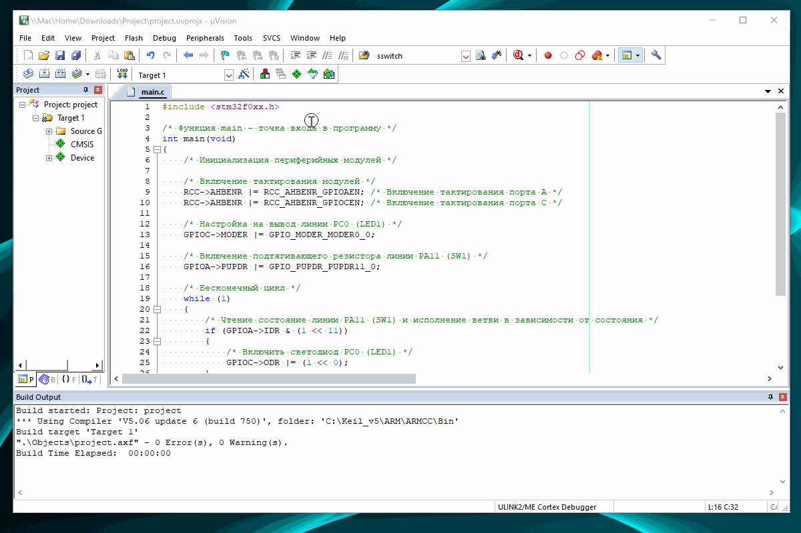

# Курс "Микропроцессорные устройства"

Целями первой части курса являются:

* изучение принципов построения микропроцессорных устройств
* изучение языка программирования Ассемблер и его применения для встраиваемых
  микропроцессорных систем
* изучение периферийных модулей микроконтроллера _STM32F072RBT6_

Целями второй части курса являются:

* изучение языка программирования C и его применения для встраиваемых
  микропроцессорных систем
* изучение периферийных модулей микроконтроллера _STM32F072RBT6_

## Подготовка к лабораторным работам

Выполнение лабораторных работ предполагает предварительную
самостоятельную подготовку: подготовка проекта, исходных текстов программы.

## Перечень директорий репозитория

* `docs` - документация на микроконтроллер и учебный стенд
    * `c_language` - шпаргалка по ассемблеру ARM и языку C
    * `learning_stand` - документация (спецификации, схемы электрические принципиальные, сборочные чертежи) на _Учебный стенд_
    * `mcu` - документация (технические описания, руководства и т.д.) на МК _STM32F072RBT6_
* `examples` - примеры лабораторных работ и задачи для практических занятий
    * `part1` - для первой части курса
        * `TODO`
    * `part2` - для второй части курса
        * `lab1` - пример задачи _Лабораторной работы №1 Порты ввода/вывода и АЦП_
        * `lab2` - пример задачи _Лабораторной работы №2 Бегущий огонь_
        * `lab3` - пример задачи _Лабораторной работы №3 Интерфейс SPI_
        * `ex1` - примеры решения четырех практических задач: _Включение светодиода_, _Включение светодиода по абсолютным адресам_,
        _Управление светодиода переключателем_, _Мигающий светодиод_
        * `ex2` - примеры решения двух практических задач: _Чтение АЦП программным опросом_, _Антидребезг кнопки_
        * `ex3` - примеры решения двух практических задач: _Внешние прерывания на портах ввода/вывода_, _Прерывание по окончанию преобразования АЦП_
        * `ex4` - пример решения практической задачи: _Бегущий огонь_
        * `ex5` - пример решения практической задачи: _Регулирование яркости светодиодов с помощью таймера_
        * `ex6` - пример решения практической задачи: _Подключение внешней Flash памяти по SPI_
        * `ex7` - пример решения практической задачи: _Часы_
* `hardware` - исходные файлы проекта _Учебный стенд_ в Altium Designer
* `img` - различные картинки используемые в README файлах
* `lectures` - слайды и тексты программ использованные на лекциях
* `programs` - программы для установки
* `tests` - проекты для теста аппаратного обеспечения _Учебного стенда_
* `templates` - шаблоны проектов

## Методические пособия

Для обучения программированию на языке C
обязательна к прочтению и **решению всех упражнений** книга
*Б. Керниган, Д. Ритчи "Язык программирования C"*

## Установка компонентов

### Keil uVision5

Разработка программ для микроконтроллера проводится
в интегрированной среде разработки (IDE)
[Keil MDK Lite Edition](http://www2.keil.com/mdk5/editions/lite).
Для загрузки потребуется регистрация на сайте Keil.
Эта версия обладает практически полной функциональностью профессиональной версии,
но с ограничением на размер скомпилированной программы в 32 кБайта.
Для лабораторных работ данного курса этого более чем достаточно.

В Keil MDK Lite Edition есть симулятор, поэтому работу программы
можно проверить без отладочной платы. Однако данный симулятор поддерживает
только центральный процессор, но не периферийные модули микроконтроллера.

Keil MDK Lite Edition изначально ничего не знает о микроконтроллерах
фирмы ST. Поэтому потребуется установить пакет
[Keil.STM32F0xx_DFP.2.1.0.pack](./programs/Keil.STM32F0xx_DFP.2.1.0.pack).

### Создание нового проекта в Keil uVision5


### Настройка подключения ST-Link в Keil uVision5



### Исправление ошибки загрузки программы в Keil uVision4


### vscode gcc

Установка всех компонентов будет происходить в командной стройке.
Последовательность действий зависит от операционой системы.

#### Windows

Открыть командную строку в режиме администратора.

* Установить пакетный менеджер __Chocolatey__

    Пакетный менеджер позволит быстро устанавливать необходмые программы не прибегая к поиску установочных файлов в интернете.

    Установка выполняется командой:
    ```bash
    Set-ExecutionPolicy Bypass -Scope Process -Force; [System.Net.ServicePointManager]::SecurityProtocol = [System.Net.ServicePointManager]::SecurityProtocol -bor 3072; iex ((New-Object System.Net.WebClient).DownloadString('https://chocolatey.org/install.ps1'))
    ```

    Проверить установку следует командой:
    ```bash
    choco --version
    ```
    Если установка прошла успешно, то в командной строке напечатается версия программы.

* Установить кросс-компилятор __arm-none-eabi-gcc__:

    ```bash
    choco install gcc-arm-embedded
    ```

* Установить утилиту __make__:

    ```bash
    choco install make
    ```

* Установить __openocd__:

    ```bash
    choco install openocd
    ```

* Установить __qemu__:

    ```bash
    choco install qemu
    ```

* Установить текстовый редактор с подсветкой синтаксиса __Visual Studio Code__:

    Установить текстовый редактор:
    ```bash
    choco install vscode
    ```

    Установить расширениe для работы с кодом на языке C/C++:
    ```bash
    code --install-extension ms-vscode.cpptools
    ```

    Установить расширение для визуализации отладки процессоров ARM Cortex:
    ```
    code --install-extension marus25.cortex-debug
    ```

    Установить расширение для подсветки систаксиса ассемблера ARM:
    ```
    code --install-extension dan-c-underwood.arm
    ```

    Установить расширение для подстветки синтаксиса скрипта компоновщика:
    ```
    code --install-extension zixuanwang.linkerscript
    ```

#### Linux

```bash
sudo apt install bin-utils
sudo apt install arm-none-eabi-gcc
sudo apt install qemu
sudo apt install code
sudo code --install-extension ms-vscode.cpptools
```

#### MacOS

```bash
brew tap ArmMbed/homebrew-formulae
brew install arm-none-eabi-gcc
brew install qemu
brew install code
sudo code --install-extension ms-vscode.cpptools
```
